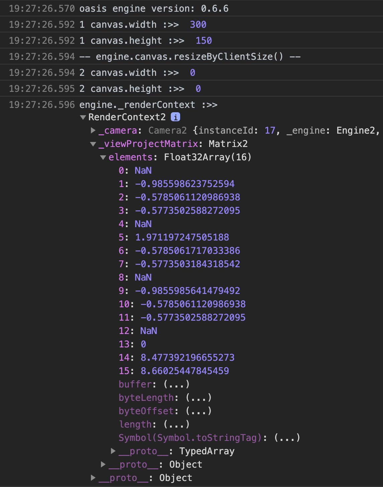
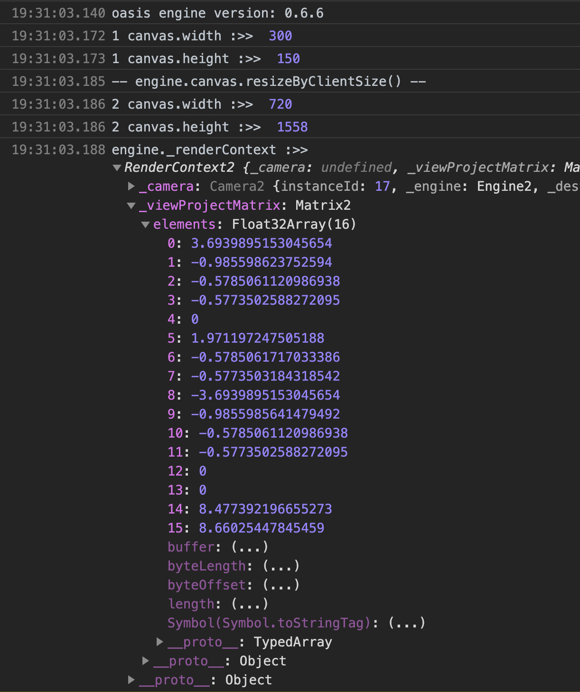

# oasis engine demo

```sh
npm install
npm run dev
```

在我手里的一台手机出现一个奇怪的bug：

在安卓webview里面打开H5页面，首次进入模型没有渲染出来，但是在H5页面调用一次location.reload()（刷新一下），模型就出来了。这边调试下来，控制台也没有报错。模型的Script类里面生命周期方法onAwake onUpdate 都调用了。

手机信息：

- 品牌：华为P30
- 型号：ELE-AL00
- 系统：HarmonyOS 2.0.0
- UA："Mozilla/5.0 (Linux; Android 10; ELE-AL00 Build/HUAWEIELE-AL00; wv) AppleWebKit/537.36 (KHTML, like Gecko) Version/4.0 Chrome/81.0.4044.138 Mobile Safari/537.36"

```ts
const canvas = document.getElementById('canvas') as HTMLCanvasElement;
const webCanvas = new WebCanvas(canvas);
const webGLRenderer = new WebGLRenderer({
  alpha: true,
});
const engine = new Engine(webCanvas, webGLRenderer) as WebGLEngine;
console.log('1 canvas.width :>> ', canvas.width);
console.log('1 canvas.height :>> ', canvas.height);
engine.canvas.resizeByClientSize();
console.log('-- engine.canvas.resizeByClientSize() --');
console.log('2 canvas.width :>> ', canvas.width);
console.log('2 canvas.height :>> ', canvas.height);
console.log('engine._renderContext :>> ', engine._renderContext);
```

首次进入：



进入页面之后reload：


